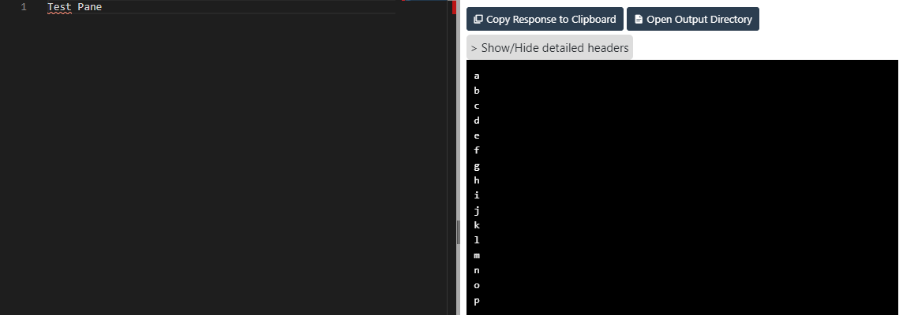

# Horizontal Split Pane for Svelte

This is a splitter plugin for Svelte Application.
Easy to use to separate panes horizontally.

#### Usage

```html
<script>
  let leftPane, rightPane;
</script>

<div this={leftPane}></div> <!-- Pane for Left Side -->
<div this={rightPane}></div> <!-- Pane for Right Side -->

<HSeparator left={leftPane} right={rightPane} /> <!-- Draggable Separator -->
```

...where leftPane / rightPane are components for each pane.

Example:


#### Optional Parameters
updateCallback: this is called when splitting is finished.
marginTop: marginTop value for splitter.
